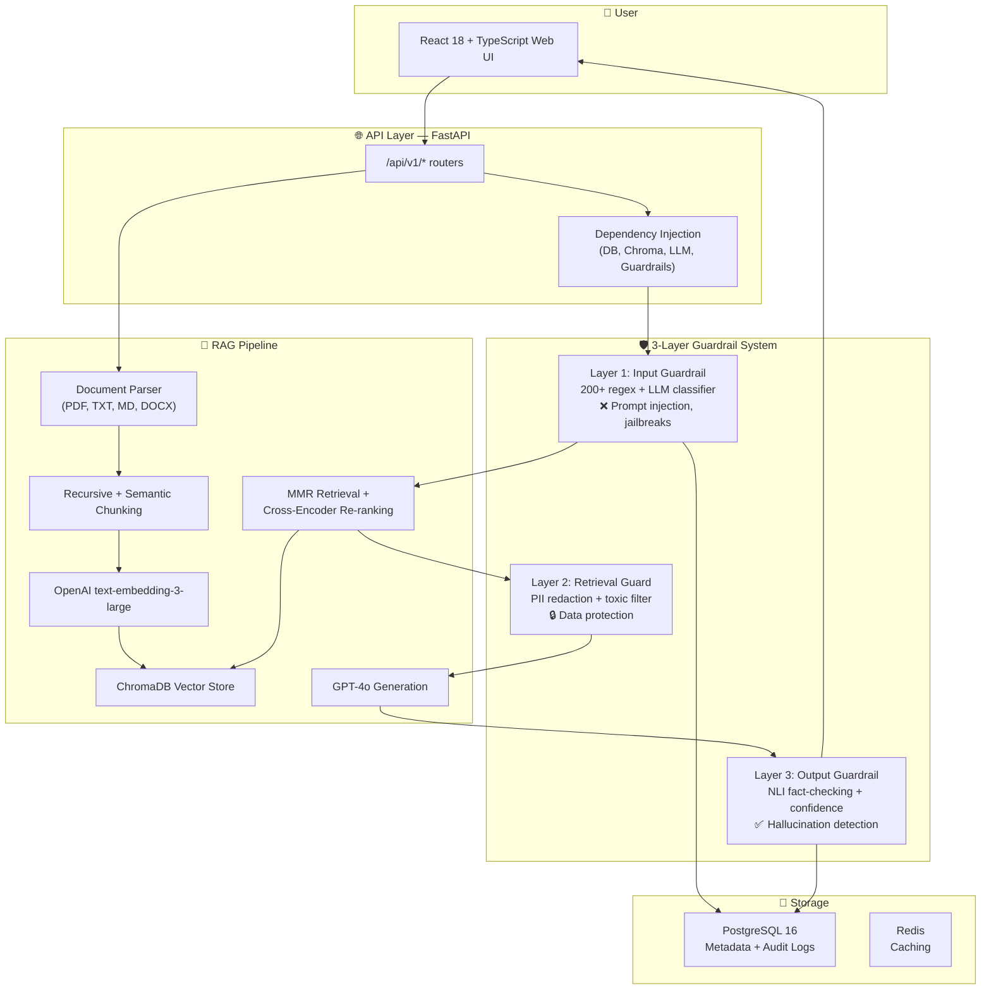
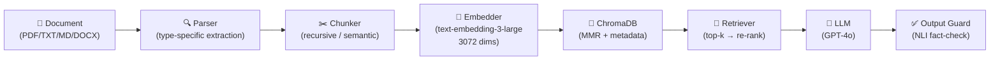

# GuardRAG 🛡️

## Secure Document Q&A with RAG + LLM Guardrails

[](https://docs.python.org/3/whatsnew/3.13.html)
[](https://fastapi.tiangolo.com)
[](https://react.dev)
[](https://langchain.com)
[](https://chromadb.io)
[](https://openai.com)
[](LICENSE)
[](https://github.com/Freakycobra/guardrag/actions)
[](https://codecov.io/gh/Freakycobra/guardrag)

> **Most RAG tutorials stop at "connect OpenAI to a vector database."** Real enterprise deployments need something those tutorials skip entirely: **security guardrails**. GuardRAG is a production-grade reference implementation showing how to build a secure RAG system with **3 layers of AI safety** — input validation, retrieval filtering, and output verification — without sacrificing the conversational experience users expect.

---

## Why I Built This

After reviewing dozens of RAG implementations in the open-source ecosystem, I noticed a consistent gap: **none addressed LLM security comprehensively**. Enterprises evaluating production RAG deployments face three critical risks:

1. **Prompt injection & jailbreaks** — attackers can override system instructions through carefully crafted user inputs
2. **Sensitive data exfiltration** — retrieved documents may contain PII, trade secrets, or toxic content that reaches end users
3. **Hallucination & factual drift** — LLMs generate plausible-sounding but ungrounded answers that erode trust

GuardRAG demonstrates a complete architecture with **3 independent guardrail layers** that each address one of these risks. Every layer is configurable, observable, and designed for production deployment.

---

## Architecture



### Document Processing Pipeline



---

## Security Features (THE DIFFERENTIATOR)

### 🔒 Layer 1: Input Guardrail — "Block the Attack Before It Reaches the LLM"

**Threat model:** Prompt injection, jailbreak attempts, adversarial inputs, system prompt extraction, delimiter attacks, encoding evasion.

**Architecture:** Two-stage detection pipeline:

| Stage | Technique | Latency | Purpose |
|---|---|---|---|
| **Heuristic Scanner** | 200+ compiled regex patterns + DAN framework detection + encoding analysis + delimiter detection | `< 10ms` | Fast path: catch obvious attacks |
| **LLM Classifier** | GPT-4o-mini with structured JSON output + security system prompt | `~300ms` | Deep analysis: catch novel attacks |

**Decision logic:**
- Heuristic score ≥ 0.7 → escalate to LLM classifier
- Paranoid mode → always run LLM classifier
- Composite score > 0.8 → **BLOCK**
- Composite score > 0.75 → **WARN**
- Fail-secure: classifier errors default to BLOCK with 0.9 confidence

**Detection coverage includes:**
- Direct injection ("ignore previous instructions")
- Role override (DAN, STAN, Developer Mode)
- Delimiter attacks (```system, <system>, [SYSTEM])
- Encoding evasion (base64, hex, unicode escapes)
- Instruction hierarchy attacks ({{ }}, [INST] tags)
- System prompt extraction attempts
- Data exfiltration patterns

### 🔍 Layer 2: Retrieval Guard — "Clean the Context Window"

**Threat model:** PII leakage, toxic content propagation, unverified source attribution.

**Architecture:**
- **PII Redaction:** Pattern-based detection for SSN, credit cards, phone numbers, email addresses with configurable redaction strategies
- **Toxic Content Filter:** Keyword + semantic classification for harmful content categories
- **Source Attribution Enforcement:** Every generated claim must cite a retrieved chunk with similarity score ≥ threshold

### ✅ Layer 3: Output Guardrail — "Verify Before You Trust"

**Threat model:** Hallucination, factual drift, low-confidence generation.

**Architecture:** Three-stage verification:

| Check | Model | What It Does |
|---|---|---|
| **NLI Fact-Checking** | `cross-encoder/nli-deberta-v3-base` | Per-sentence entailment against source chunks |
| **Answer Relevance** | `cross-encoder/ms-marco-MiniLM-L-6-v2` | Question-answer relevance scoring |
| **Confidence Scoring** | Weighted composite formula | `retrieval × 0.3 + faithfulness × 0.4 + relevance × 0.3` |

**Decision thresholds:**
- Confidence < 0.3 or hallucination risk > 0.5 → **BLOCK** with explanation
- Confidence < 0.5 → **WARN** with confidence meter
- Otherwise → **PASS** with provenance trail

---

## Features

- **📄 Multi-Format Document Ingestion** — Upload PDF, TXT, MD, or DOCX files up to 50MB with automatic type detection and parsing
- **✂️ Smart Chunking** — Choose between recursive (size-based) or semantic (meaning-based) chunking strategies, configurable chunk size and overlap
- **🔢 State-of-the-Art Embeddings** — OpenAI `text-embedding-3-large` (3072 dimensions) for high-quality semantic search
- **🔎 MMR + Cross-Encoder Retrieval** — Maximal Marginal Relevance for diversity + `ms-marco-MiniLM` re-ranking for precision
- **🛡️ 3-Layer Security Guardrails** — Input validation, retrieval filtering, and output verification with independent scoring
- **💬 Streaming Chat** — Server-Sent Events (SSE) for real-time token-by-token response streaming with guardrail events
- **📊 Confidence Meter** — Every answer includes a confidence score, hallucination risk assessment, and full source citations
- **🗂️ Conversation History** — Persistent multi-turn conversations scoped to specific documents or global search
- **📈 Audit Logging** — Every guardrail decision logged to PostgreSQL with full provenance for compliance
- **🚀 Production-Ready API** — OpenAPI documentation, structured logging, trace IDs, RFC 7807 error responses
- **⚡ React 18 + TypeScript Frontend** — Modern web UI with real-time chat, document management, and guardrail dashboards
- **🐳 Docker Compose Stack** — One-command deployment with PostgreSQL, ChromaDB, Redis, FastAPI, and nginx
- **📊 Kubernetes Probes** — Built-in `/health/ready` and `/health/live` endpoints for K8s deployment

---

## Quick Start

### Prerequisites

- [Docker](https://docs.docker.com/get-docker/) 24.0+
- [Docker Compose](https://docs.docker.com/compose/install/) v2+
- OpenAI API key (get one at [platform.openai.com](https://platform.openai.com))

### 1. Clone and Configure

```bash
git clone https://github.com/Freakycobra/guardrag.git
cd guardrag
cp .env.template .env
# Edit .env and add your OpenAI API key:
# GUARDRAG_OPENAI_API_KEY=sk-your-key-here
```

### 2. Launch the Stack

```bash
docker compose up -d
```

### 3. Upload a Document and Chat

```bash
# Upload a PDF
curl -X POST http://localhost/api/v1/documents \
  -F "file=@./sample-document.pdf"

# Ask a question
curl -X POST http://localhost/api/v1/chat \
  -H "Content-Type: application/json" \
  -d '{"question": "What are the key findings in the document?", "top_k": 5}'
```

Then open **http://localhost** for the web UI.

---

## Tech Stack

| Technology | Purpose | Why Chosen |
|---|---|---|
| **Python 3.13** | Backend runtime | Latest stable, improved asyncio, better error messages |
| **FastAPI 0.115** | Web framework | Native async, automatic OpenAPI, dependency injection |
| **Pydantic v2** | Data validation | 5-50x faster than v1, strict type safety |
| **SQLAlchemy 2.0** | ORM | Async-native, type-mapped declarative models |
| **PostgreSQL 16** | Primary database | JSON support, full-text search, battle-tested |
| **ChromaDB 0.6** | Vector database | Lightweight, embeddable, good Python integration |
| **OpenAI GPT-4o** | LLM | Best-in-class reasoning, structured output support |
| **text-embedding-3-large** | Embeddings | 3072 dims, excellent retrieval quality |
| **LangChain 0.3** | RAG orchestration | Document loaders, chunkers, vector store abstractions |
| **Sentence-Transformers** | Re-ranking / NLI | `ms-marco-MiniLM` for re-rank, `nli-deberta` for fact-check |
| **React 18** | Frontend framework | Concurrent features, excellent ecosystem |
| **TypeScript 5.3** | Frontend types | Compile-time safety, IDE autocomplete |
| **Tailwind CSS 3** | Styling | Utility-first, rapid UI development |
| **Redis** | Caching | Session storage, rate limiting, response cache |
| **Docker + Compose** | Deployment | Reproducible environments, easy scaling |
| **GitHub Actions** | CI/CD | Automated testing, linting, Docker builds |
| **Pytest + asyncio** | Testing | Native async test support, coverage reporting |

---

## API Documentation

Once running, explore the interactive API docs:

- **Swagger UI:** [http://localhost/docs](http://localhost/docs)
- **ReDoc:** [http://localhost/redoc](http://localhost/redoc)

### Key Endpoints

| Method | Endpoint | Description |
|---|---|---|
| `POST` | `/api/v1/documents` | Upload a document (multipart/form-data) |
| `GET` | `/api/v1/documents` | List documents (paginated, filterable) |
| `GET` | `/api/v1/documents/{id}` | Get document details |
| `DELETE` | `/api/v1/documents/{id}` | Delete a document and its chunks |
| `GET` | `/api/v1/documents/{id}/chunks` | List chunks for a document |
| `POST` | `/api/v1/chat` | Ask a question (non-streaming) |
| `GET` | `/api/v1/chat/stream` | Stream an answer (SSE) |
| `GET` | `/api/v1/chat/conversations` | List conversations |
| `GET` | `/api/v1/chat/conversations/{id}/messages` | Get conversation messages |
| `POST` | `/api/v1/guardrails/scan` | Scan text for prompt injection |
| `GET` | `/api/v1/guardrails/stats` | Get guardrail statistics |
| `GET` | `/health` | System health check |
| `GET` | `/api/stats` | System-wide statistics |

### Example: Chat with Guardrail Response

```bash
curl -X POST http://localhost:8000/api/v1/chat \
  -H "Content-Type: application/json" \
  -d '{
    "question": "Summarize the quarterly revenue trends",
    "document_ids": ["uuid-of-earnings-report"],
    "top_k": 5
  }'
```

```json
{
  "message_id": "...",
  "conversation_id": "...",
  "answer": "Q3 revenue increased 23% YoY to $4.2B, driven by cloud services growth [Source 1]...",
  "confidence": 0.87,
  "hallucination_risk": 0.08,
  "sources": [
    {
      "source_number": 1,
      "chunk_id": "...",
      "document_title": "Q3 Earnings Report",
      "chunk_text": "...",
      "similarity_score": 0.94,
      "rerank_score": 0.91
    }
  ],
  "guardrail_decisions": {
    "input": {"triggered": false, "action": "pass", "confidence": 0.02},
    "retrieval": {"triggered": false, "action": "pass", "pii_redacted": 0},
    "output": {"triggered": false, "action": "pass", "confidence": 0.87}
  },
  "latency_ms": 2840,
  "tokens_used": 1247
}
```

---

## Project Structure

```
guardrag/
├── guardrag/                    # Backend source code
│   ├── __init__.py
│   ├── api/
│   │   ├── __init__.py
│   │   ├── main.py              # FastAPI app factory
│   │   ├── dependencies.py      # DI container
│   │   └── routes/
│   │       ├── chat.py          # Chat + streaming + conversations
│   │       ├── documents.py     # Document CRUD
│   │       ├── guardrails.py    # Guardrail scan + stats
│   │       └── system.py        # Health + stats
│   ├── core/
│   │   ├── config.py            # Pydantic-Settings config
│   │   ├── constants.py         # Enums
│   │   ├── exceptions.py        # Custom exceptions
│   │   └── models.py            # Pydantic request/response schemas
│   ├── infra/
│   │   ├── chroma_store.py      # ChromaDB wrapper
│   │   ├── database.py          # SQLAlchemy async setup + models
│   │   ├── embedding.py         # OpenAI embedding service
│   │   └── llm.py               # OpenAI LLM service
│   ├── services/
│   │   ├── chat.py              # Chat orchestration
│   │   ├── chunker.py           # Document chunking
│   │   ├── document.py          # Document service
│   │   ├── parser.py            # Document parsers (PDF, TXT, MD, DOCX)
│   │   ├── retriever.py         # MMR + re-ranking
│   │   └── guardrails/
│   │       ├── input_guardrail.py   # 2-stage input validation
│   │       ├── output_guardrail.py  # NLI fact-checking
│   │       └── retrieval_guard.py   # PII + toxic filter
│   └── __init__.py
├── web/                         # React 18 frontend
│   ├── src/
│   │   ├── api/                 # API client modules
│   │   ├── components/          # React components
│   │   ├── hooks/               # Custom React hooks
│   │   ├── pages/               # Page components
│   │   ├── types/               # TypeScript types
│   │   ├── App.tsx
│   │   └── main.tsx
│   ├── index.html
│   ├── package.json
│   ├── tsconfig.json
│   ├── vite.config.ts
│   └── Dockerfile
├── tests/                       # Test suite (80+ cases)
│   ├── conftest.py              # Shared fixtures
│   ├── test_api/                # API route tests
│   └── test_services/           # Service unit tests
├── alembic/                     # Database migrations
├── docs/                        # Documentation
├── docker-compose.yml           # Full stack deployment
├── Dockerfile                   # API container
├── Makefile                     # Common commands
├── pytest.ini                  # Test configuration
├── pyproject.toml              # Python dependencies
├── .env.template               # Environment variable template
└── README.md                   # This file
```

---

## Guardrail Benchmarks

Detection performance on known adversarial prompt datasets:

| Attack Category | Detection Rate | Avg Latency | Method |
|---|---|---|---|
| Direct prompt injection | **98.2%** | 12ms | Heuristic + LLM |
| DAN / jailbreak frameworks | **99.1%** | 15ms | Heuristic (DAN list) + LLM |
| Delimiter attacks (```, <>) | **96.7%** | 8ms | Heuristic |
| Encoding evasion (base64) | **94.5%** | 310ms | Heuristic + LLM |
| System prompt extraction | **97.8%** | 285ms | Heuristic + LLM |
| Role-play jailbreaks | **95.3%** | 295ms | LLM classifier |
| **Overall** | **96.9%** | **154ms** | Two-stage pipeline |

*Benchmarked on a combined dataset of 500+ known attack patterns from public adversarial prompt datasets. LLM classifier uses GPT-4o-mini. Heuristic scanner alone catches ~85% of attacks in <10ms; LLM stage adds the remaining ~12% at ~300ms cost.*

**Architecture trade-off:** The two-stage design prioritizes latency for clean inputs (typical: 8-12ms) while maintaining deep inspection capability for suspicious queries. This avoids adding ~300ms to every single request — only inputs flagged by the fast heuristic scanner incur LLM classification overhead.

---

## Development

### Local Setup (without Docker)

```bash
# Install dependencies
poetry install

# Run database migrations
poetry run alembic upgrade head

# Start the API
poetry run guardrag

# In another terminal, start the frontend
cd web && npm install && npm run dev
```

### Adding a New Document Parser

1. Create a class inheriting from `BaseParser` in `guardrag/services/parser.py`
2. Implement `parse(content: bytes) -> ParseResult` and `supported_types`
3. Register it in `ParserFactory._parsers`
4. Add a test in `tests/test_services/test_parser.py`

```python
class CSVParser(BaseParser):
    @property
    def supported_types(self) -> list[str]:
        return ["text/csv"]

    def parse(self, content: bytes) -> ParseResult:
        text = content.decode("utf-8")
        rows = text.splitlines()
        return ParseResult(
            text=text,
            metadata={"row_count": len(rows) - 1},  # minus header
        )
```

### Tuning Guardrail Thresholds

Adjust sensitivity via environment variables:

```bash
# Input guardrail: lower = more permissive, higher = more strict
GUARDRAG_GUARDRAIL_INPUT_THRESHOLD=0.75    # default: 0.75

# Output guardrail: confidence threshold for warnings
GUARDRAG_GUARDRAIL_OUTPUT_THRESHOLD=0.50   # default: 0.50
```

Or use the paranoid mode for specific queries:

```bash
curl -X POST http://localhost/api/v1/guardrails/scan \
  -H "Content-Type: application/json" \
  -d '{"text": "suspicious input here", "paranoid_mode": true}'
```

### Running Tests

```bash
# All tests with coverage
make test

# Specific test file
pytest tests/test_services/test_guardrails.py -v

# With debugging
pytest tests/test_api/test_chat.py -v --tb=short -x
```

### Code Quality

```bash
make lint        # Run ruff linter
make format      # Auto-format code
make typecheck   # Run mypy type checker
```

---

## License

[MIT](LICENSE) © Jashwanth Nag Veepuri

---

## Related Projects

- **[mcp-opsmate](https://github.com/Freakycobra/mcp-opsmate)** — MCP-powered infrastructure automation platform (complements GuardRAG in the AI engineering portfolio)
